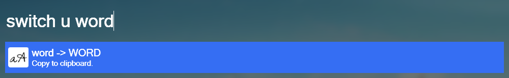

# Wox.Plugin.SwitchCase

Switch letter Case.

## Example

- `switch u words`
- `switch l WORDS`

## Keywords

- `u` or `upper`: upper words
- `l` or `lower`: lower words

Also you can change keywords at [constants.py](switchcase/constants.py).

## Requirement

- Python3.x
- pyperclip
